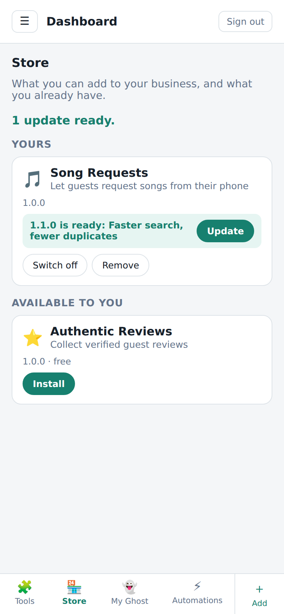
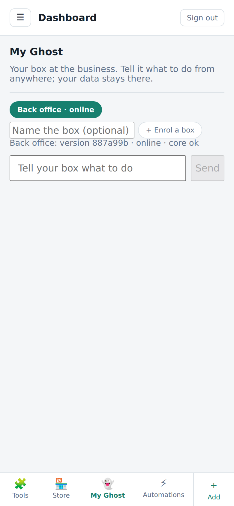
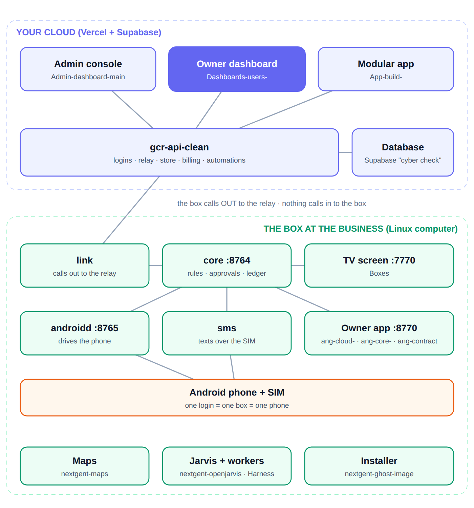

# Business dashboard

**This is the dashboard a business owner logs into — one business, identified by
its slug.** It is not the operator console. The operator console, where you see
every business at once, is `Admin-dashboard-main`.

Copied here from `admin-dashboard-` so the name says what it is; that repo's
name (`admin-dashboard-`, package `dashboard-shell`) read as an admin tool and
sat one hyphen away from `Admin-dashboard-main`, which is a different product.
Treat this copy as the one to work on.

Both talk to the same backend, `gcr-api-clean`. Production:
`dashboards-users.vercel.app`. It is built phone-first: a bottom bar, no sidebar.

In the Ghost system this is a cloud-side screen: a static React app that only
calls `gcr-api-clean`. It never talks to a Ghost box directly; "My Ghost" queues
a request at the API, the box pulls it over its own outbound link and posts the
answer back (`src/pages/Ghost.jsx`).

| Store | My Ghost |
| --- | --- |
|  |  |

*Captured against a test backend with sample data (one installed app with an
update waiting, one free app available, one online box).*

**Store** shows what the operator made available to this business (free, in its
plan, or granted), lets it install, switch off, configure and remove apps, and
pull updates. An update that asks for more access is never applied without the
owner saying yes. **My Ghost** is the business's own box, reachable from anywhere
through the relay: enrol a box (the page shows a one-time token to put in
`~/.config/ghost/ghost.env` as `NEXTGENT_NODE_TOKEN`), see it online, tell it
what to do, see whether it needs a YES text and the verified result; the example
phrases it suggests come from the box itself. **Automations** lists what the
operator pushed to this business. **Tools** connects third-party accounts
(Composio) through `/api/connections`.



---

Every business gets sections built from its own data. Nothing is hardcoded per
business or per industry.

A business is identified by its **slug** (`flora-bama-yacht-club`). Everything
about it lives in tables carrying an `entity_slug` column. The dashboard has no
list of features: it asks the database what tables exist, pulls the rows
belonging to that slug, and turns every table that has data into a section. A
restaurant ends up with Menu, Hours, Happy Hour. A charter ends up with Trips,
Species, Meeting Points, Weather Rules. Same code, different data.

Add a table to the database and it appears in every business that has data in
it. Drop it and the section disappears. No deploy, no code change.

The business decides what goes in their dashboard. The **Add** tab lists every
slug table the schema supports that they aren't using yet — grouped, searchable,
including tables nobody has written any code for. Pick one, fill in the form
built from that table's columns, and it becomes a live section. A business with
nothing entered starts from that catalog rather than an empty screen.

## Run it

```bash
npm install
npm run dev      # http://localhost:5173
npm run build    # production build into dist/
npm run check    # discovery + table-mapping checks, no network needed
npm run lint     # oxlint
```

Deploy `dist/` anywhere static. Settings (all optional, copy `.env.example` to
`.env.local`): `VITE_GCR_API_BASE` (defaults to `https://gcr-api-clean.vercel.app`),
`VITE_LOGIN_DOMAIN` (defaults to `biz.gulfcoastradar.com`) and
`VITE_REQUEST_TIMEOUT_MS` (defaults to 30000). This
app holds **no database key and never talks to the database**: every read and
every write goes through `gcr-api-clean`, which decides which business you are
from your session, never from anything the browser sends.

## Where the data comes from

| What | Endpoint |
| --- | --- |
| Who you are, what you own, admin or not | `GET /api/business/me` |
| Which tables can be sections, and their columns | `GET /api/business/schema` |
| Every section that has rows, in one call | `GET /api/business/sections` |
| Create / update / delete a row | `POST/PATCH/DELETE /api/business/:table[/:id]` |
| Sign up and sign in by phone code | `/api/business-auth/*` |
| The business's public listing payload (`Dashboard.jsx`) | `GET /api/gcr/entity/:slug` |
| Industry list, read live | `GET /api/business/industries` |
| Invite links | `GET /api/auth/invite/:token`, `POST /api/auth/accept-invite` |
| Claim a business | `GET /api/gcr/entities?search=`, `POST /api/gcr/claim` |
| Tools (Composio connections) | `/api/connections` (`GET`, `:toolId/connect`, `:toolId/refresh`, `DELETE :toolId`) |
| Store | `/api/store` (`GET`, `:id/install`, `:id/update`, `:id/disable`, `:id/enable`, `DELETE`, `PATCH :id/config`) |
| My Ghost | `/api/nodes` (enrol, list, send a request, read the answer) |
| Automations | `/api/business/automations` |

Hosts live in `src/lib/config.js`; every path lives once in `src/lib/endpoints.js`.

### The API renames tables

`buildFullEntity()` in gcr-api-clean reshapes some tables before sending them —
`entity_hours` arrives as `hours`, `entity_offer_fee` as `fees`. `src/lib/tableMap.js`
maps those names back, which is what lets an API-supplied section be edited (the
write has to name a real table). Anything not in the map is assumed to already be
a real table name, so a table added tomorrow still works untouched.

## The files that matter

**Engine — `src/lib/`**

| File | What it does |
|---|---|
| `schemaDiscovery.js` | Asks `GET /api/business/schema` which tables carry an `entity_slug` and what their columns are, so edit forms build themselves. |
| `entityTables.js` | Loads every section that has rows with one call to `GET /api/business/sections` and caches it for five minutes. |
| `discoverSections.js` | Turns raw results into sections. Merges the API payload with the swept tables, labels and icons them. |
| `sectionCatalog.js` | The other half — everything the business *could* add but isn't using yet. Internal tables (AI indexes, access control, audit/log/analytics tables, other people's Trip Swipe data, SMS/message tables, backups) are hidden everywhere. Tables that other people write to (bookings, orders, customers, requests, leads and the like) still show as sections once they have rows but are never offered under Add. |
| `tableMap.js` | API payload key ↔ real table name. |
| `gcrApi.js` | The gcr-api-clean calls for entity search and claim. |
| `writeEntityData.js` | **Every write goes through here.** It sends no slug: the API takes the business from the session and puts it in the WHERE clause itself. |
| `AuthContext.jsx` | Sign in, session, access. Resolves which business you are from `entity_owners`, admin status from `platform_admins` — both server-side. |
| `config.js` | The API host, the sign-in login domain and the request timeout. No database host or key. |
| `apiClient.js` / `endpoints.js` | The fetch wrapper (session token, typed errors) and every API path, once. |
| `authStore.js` | Where the session lives (`localStorage`), token renewal, and the slug an admin is acting on. |
| `shapes.js` | Works out from a table's columns and rows whether it is a progress bar, a price list or a fan-submitted inbox, and masks other people's contact details. |
| `appStore.js` / `automations.js` / `industries.js` / `useTheme.js` | Calls and helpers for Tools, Automations, the industry list and the light/dark/auto theme. |

**Screens — `src/pages/`** — `Login`, `SignUp`, `AcceptInvite`, `Claim`, `Dashboard`, `BusinessPicker` (admin only), `Store`, `Ghost` (My Ghost), `Automations`, `AppStore` (Tools, the Composio connections).

**Layout — `src/components/`** — `TopBar`, `BottomNav` (one tab per discovered
section plus a permanent Add tab; mobile-first, no sidebar), `MainContent`,
`AddSection` (the catalog), `RowEditor` (builds a form from a table's columns),
`AppStoreView` (the Tools list).

**Sections — `src/sections/`** — `GenericSection` renders *any* table by
inspecting the shape of its rows. `registry.jsx` maps a handful of purpose-built
renderers; it does **not** define which sections exist — discovery does.

## Artist module

Artists are businesses like any other — same slug, same discovery, same editor.
Most of the module already exists in the database (`artist_profiles`, `songs`,
`song_requests`, `shoutouts`, `artist_goals`, `song_cooperatives`, `tip_links`,
`artist_shows`, `artist_follows`, `artist_booking_requests`).

What did not exist is the part the artist needs to control: **what anything
costs.** `sql/artist_module.sql` adds it (the file's own header calls it a
proposal: "NEVER RUN") —

| Thing | Where the artist sets it |
|---|---|
| Price per song | `songs.price` (falls back to `artist_profiles.default_min_request_amount`) |
| Custom-song price | `artist_profiles.custom_song_price` |
| Shoutout tiers | `artist_price_tiers` where `kind = 'shoutout'` |
| Tip buttons | `artist_price_tiers` where `kind = 'tip'` |
| Crowdfund amounts | `artist_price_tiers` where `kind = 'crowdfund'` |
| Crowdfund targets | `artist_goals`, `song_cooperatives` |
| Cash App / Venmo / PayPal | `tip_links` (platform, handle, deep-link prefix) |
| Requests open right now | `artist_profiles.requests_open` |

`artist_price_tiers` is one table behind every money button on the fan pages, so
a new kind of paid thing is a row — not a schema change and not a deploy.

**Nothing about this is hardwired.** `src/lib/artistModule.js` contains only
nicer words — labels, icons, and a name pattern for catalog grouping. Delete it
and the artist dashboard still works; it just says "Artist Price Tiers" instead
of "Prices". Every decision that matters is made from the live schema and the
shape of the rows, in `src/lib/shapes.js`:

| Decision | How it's made |
|---|---|
| Which sections exist | Tables with rows for this slug |
| What you can add | Every slug table you aren't using yet |
| Progress bar or not | Row has a raised/target numeric pair |
| Price layout or not | Rows have a kind + label + amount |
| Held back from Add | Row carries somebody else's identity, or the name says it collects submissions |
| Contact masking | Field name matches a contact convention |

A `merch_crowdfund` table invented tomorrow gets a progress bar. A
`sponsor_tiers` table gets the grouped price layout. A `wish_wall` table with a
`patron_phone` column is recognised as fan-submitted and held out of the Add
catalog with its phone numbers masked. None of those names is used in the code: the only
mentions in `src/` are two example comments in `src/lib/shapes.js`. `npm run check`
(`scripts/check-discovery.mjs`) feeds the detectors tables invented like these and
asserts they get the right treatment.

Fan-submitted tables still show as sections once they have rows (that's the
artist's queue); they're just never offered as something to *add*, because the
artist isn't the author.

**The fan-facing pages live in `gcr-unified`, not here** — `/artist/:slug` and
`/artist/:slug/live`. They currently hardcode their amounts; once this SQL is
run they should read `artist_price_tiers` and `tip_links` instead. See
`docs/PORT_REVIEW.md`.

## Access

Which business you are, and whether you are an admin, is decided by
`gcr-api-clean` from your session: `entity_owners` links a login to a business,
`platform_admins` lists admins. The database functions `owns_entity` and
`is_platform_admin` from `sql/ownership_and_write_access.sql` exist on the live
database. `sql/entity_sections.sql` is **not** applied and is no longer needed
(the API does that sweep).

**A login only reaches a dashboard once it has a row in `entity_owners`.** As of
2026-09-29 that table has no rows on the live database, so no business owner can
sign in to a business yet. Claims, invites and `sql/seed_first_owner.sql` are the
ways to create the first ones.

Provision logins with `scripts/provision-accounts.mjs` (dry-run first; it needs
the service key in the environment, and writes credentials to
`business-credentials.csv`, which is gitignored and should be treated as secret):

```bash
SUPABASE_SERVICE_KEY=<service_role key> node scripts/provision-accounts.mjs --dry-run --limit=5
```

`scripts/make-setup-links.mjs` (same key) writes one-time password-setup links to
`setup-links.csv`, also gitignored. `scripts/reconcile-tables.mjs` and
`scripts/build-reconciliation-page.mjs` read `docs/reconciliation/`, which is not
in this repo, so they cannot run as checked in.

Ways in, as built: a texted six-digit code (`Login.jsx`), a business login and
password for provisioned or invited accounts, an invite link (`?token=`,
`AcceptInvite.jsx`), a claim, or a new sign-up (`SignUp.jsx`: phone, code,
business name, industry; the listing stays hidden until reviewed).

**Admin deep link** — from CyberCheck admin, link each business row to
`https://<dashboard-host>/?business=<slug>`. That opens that business's
dashboard with an "Admin view" banner. With no `?business=`, admins land on the
searchable picker.

## Automations

The operator builds automations and scripts in `Admin-dashboard-main` and
pushes them here — a "cloud update" for dashboards. The **Automations** tab
(`src/pages/Automations.jsx`) shows what was pushed to this business, at the
version it was given: switch each one on or off, fill in the settings it asks
for, run it now, pull a newer version when one is waiting, copy or replace the webhook
URL that runs it, and open its run history to see what every step did.

Nothing is built on this side. Everything goes through
`/api/business/automations` on gcr-api-clean, scoped by the session like the
rest of `/api/business`. The two tables behind it (`entity_automations`,
`automation_runs`) carry `entity_slug` but are held back from section discovery
by the API, so they never appear as editable sections or in the Add catalog.

## Claims

A business without a login uses **Claim your business** on the sign-in screen.
That searches `GET /api/gcr/entities` and posts to `POST /api/gcr/claim`, which
writes a `business_claims` row with status `new`. It grants nothing on its own —
an admin reviews it through `GET /api/admin/gcr/claims` and
`PATCH /api/admin/gcr/claims/:id`. Those two only list the claims and set their
status and notes; the login and the `entity_owners` row are created by a separate
admin step (for example `POST /api/admin/link-user`). The `admin.html` GCR Claims
panel in cybercheck-login that this flow was written against is not in this
workspace, so its behaviour is not checked here.

## Status

**Verified:** builds clean; `npm run check` passes; section discovery, table
mapping and the add catalog tested against realistic restaurant and charter
payloads. The Store, My Ghost and Automations tabs were driven in a real browser
(Chromium) against a test backend running the real `gcr-api-clean` store routes.

**Deployed** to production. **Not yet proven end to end on the live stack:** a
real business signing in, because no login is linked to a business yet (see
Access).

**Note on writes:** the Add catalog offers every table the schema supports, but
what a business may actually write is decided by the API (`lib/businessTables.js`
in gcr-api-clean holds the allow-list). See `docs/PORT_REVIEW.md`.

`docs/everything.html` is the full record — the architecture write-up, the
extracted product spec, the module-source analysis, and the reconciliation of
the 244-table design against the 563-table live database. Open it in a browser;
it needs no server and no network.

`docs/PORT_REVIEW.md` lists what this port was missing and what to fix first. It
was written before the switch to `gcr-api-clean` and parts are out of date: it still
describes a browser Supabase client and anon key (none in `src/` now) and lists
Composio connections and any app concept as "not built at all", although
`src/pages/AppStore.jsx` and `src/pages/Store.jsx` now exist.
